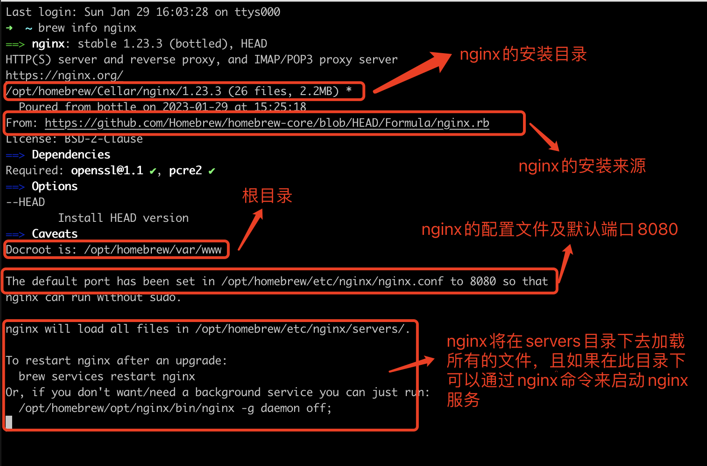
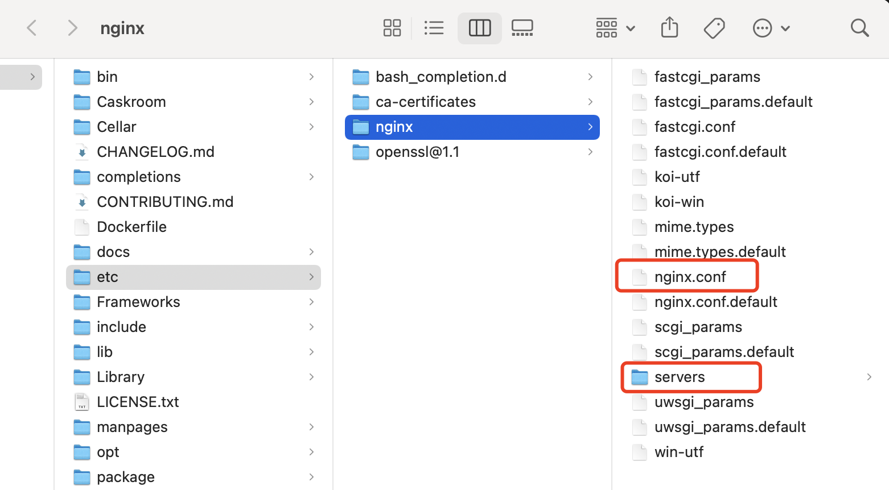
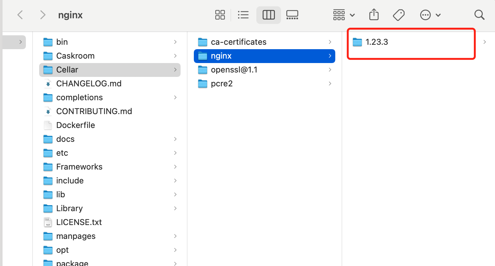
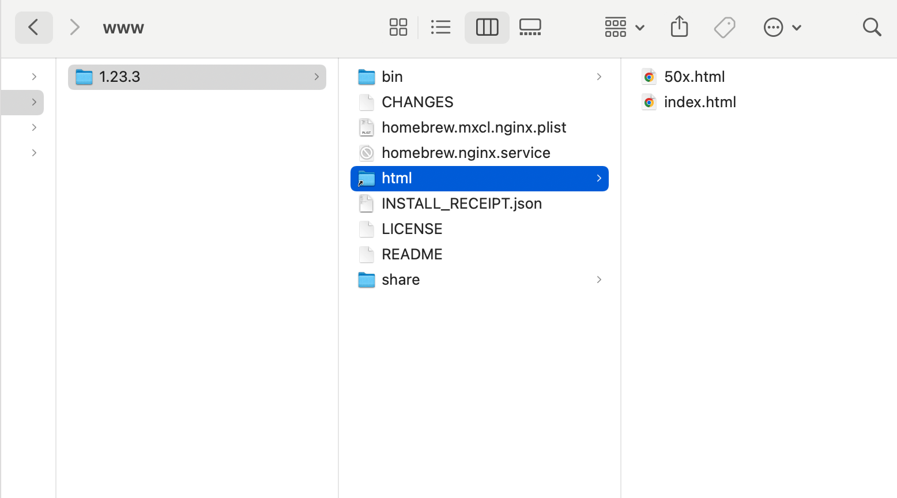
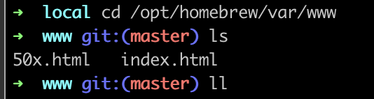
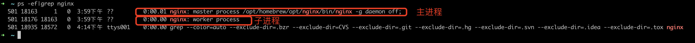
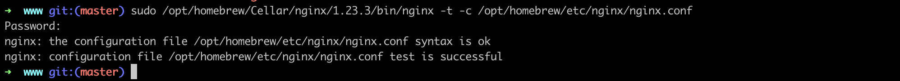

### brew安装nginx

    brew install nginx

### 查看nginx的配置信息

    brew info nginx

  
如上面的截图，From:xxx 这样的，是nginx的来源，Docroot默认为 /opt/homebrew/var/www，在/opt/homebrew/etc/nginx/nginx.conf 配置文件中默认的端口为8080， 且nginx将在/opt/homebrew/etc/nginx/servers/目录中加载所有文件。并且我们可以通过最简单的命令'nginx' 来启动nginx.

### 查看nginx安装目录

    open /opt/homebrew/etc/nginx/

如下图所示：
  
​
打开nginx目录后，可以看到我们上面的使用 brew info nginx 查看信息所说的 server目录以及nginx.conf的配置文件，那么我们的nginx被安装到什么地方呢？我们从上面的截图可以看到，是在 这个目录下 /opt/homebrew/Cellar/nginx

### 执行如下命令可以查看到

    open /opt/homebrew/Cellar/nginx

会打开目录，如下图所示：
  
​
进入上面的 1.23.3文件后，如下图所示：
  
​
在该目录下可以看到一个名字为html的快捷方式的文件夹，进入该目录后，它有两个文件50.html和index.html
​
其实它是指向的就是 /opt/homebrew/var/www目录的，为什么这么说，我们来看下进入该目录后，查看下面有哪些文件就可以看到，如下图：  
  
​
### 启动nginx服务，如下命令：

    nginx

重启后，我们验证下，因为nginx默认的端口号是8080，因此我们页面访问 http://localhost:8080 即可，看到如下信息：
​
如果成功的话，一般都是 欢迎的界面(index.html页面我自己改过)，下面我们继续查看下nginx.conf 配置信息，使用如下命令：

    cat /opt/homebrew/etc/nginx/nginx.conf

如上，就可以使用nginx搭建本地服务了。

### 总结nginx常见的配置  
nginx的配置文件路径：/opt/homebrew/etc/nginx/nginx.conf  
nginx的服务器默认路径：/opt/homebrew/var/www  
nginx的安装路径：/opt/homebrew/Cellar/nginx/1.23.3  

### nginx启动：

1.1、在终端输入 ps -ef|grep nginx 命令看是否启动，如下：
  
​
1.2、验证配置文件是否正确，因此在启动nginx之前，我们可以先运行下如下命令：

    sudo /opt/homebrew/Cellar/nginx/1.23.3/bin/nginx -t -c /opt/homebrew/etc/nginx/nginx.conf

注意：一定要注意路径是否是自己的安装路径。这边我的nginx是1.23.3版本的。
​ 

如果出现如下信息，说明配置文件正确。

    nginx: the configuration file /opt/homebrew/etc/nginx/nginx.conf syntax is ok
    nginx: configuration file /opt/homebrew/etc/nginx/nginx.conf test is successful

### 重启nginx有如下几种方法：
1.3、通过brew，brew services start nginx(启动nginx) brew services restart nginx(重启命令)  
或者   

    nginx -s reload  
​或者   
1.5、根据进程号重启，执行命令 kill -HUP 进程号
​
### nginx停止
终端输入ps -ef|grep nginx获取到nginx的进程号, 注意是找到“nginx:master”的那个进程号  
​
注意：  
kill -QUIT 72 (从容的停止，即不会立刻停止)  
Kill -TERM 72 （立刻停止）  
Kill -INT 72 （和上面一样，也是立刻停止）
或者

    nginx -s stop
