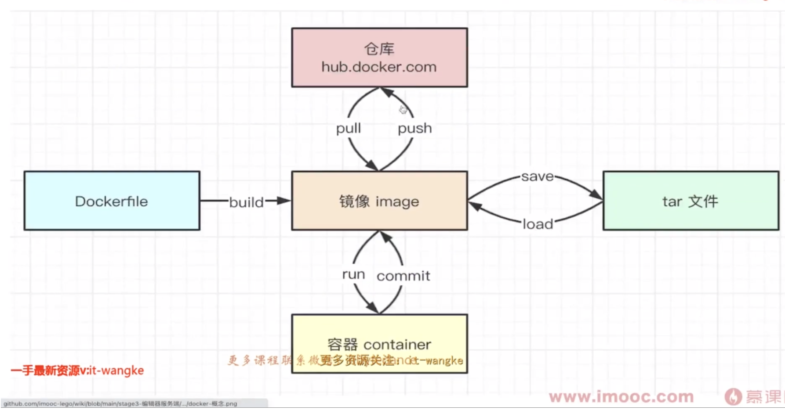

## Docker 镜像加速

阿里云镜像获取地址：https://cr.console.aliyun.com/cn-hangzhou/instances/mirrors，登陆后，左侧菜单选中镜像加速器就可以看到你的专属地址了

    sudo mkdir -p /etc/docker
    sudo tee /etc/docker/daemon.json <<-'EOF'
    {
    "registry-mirrors": ["https://n4zw73h4.mirror.aliyuncs.com"]
    }
    EOF
    sudo systemctl daemon-reload
    sudo systemctl restart docker

## 基本概念

## 常用命令
image镜像  
- 下载镜像 `docker pull <image-name>:<tag>`
- 查看所有镜像 `docker images`
- 删除镜像 `docker rmi <image-id>`
- 上传镜像 `docker push <username>/<repository>:<tag>`，要先注册 hub.docker.com
> 如果 docker images 出现 REPOSITORY 是`<none>`的情况，可以运行 `docker image prune` 删除

container
- 启动容器 `docker run -p xxxx:xxxx -v=hostPath:containerPath -d --name <container-name> <image-name>`
  1. -p 端口映射
  2. -v 数据卷，文件映射
  3. -d 后台运行
  4. --name 定义容器名称
- 查看所有容器 `docker ps`，加 -a 显示隐藏的容器
- 停止容器 `docker stop <container-id>`
- 删除容器 `docker rm <container-id>`，加 -f 是强制删除
- 查看容器信息，如IP地址 `docker inspect <container-id>`
- 查看容器日志 `docker logs <container-id>`
- 进入容器控制台 `docker exec -it <container-id> /bin/sh`
    

## 功能演示
以nginx为例  

    docker run -p 81:80 -d --name nginx1 nginx
    docker ps
    # 访问localhost:81，并且查看 log
    docker exec -it <container-id> /bin/sh
    cd /usr/share/nginx/html

    # 修改文件，宿主机终端中操作

    #将容器中的文件拷贝出来
    docker cp <container-id>:/usr/share/nginx/html/index.html /Users/yangpan/Desktop/shell/  
    #将容器中的文件拷贝回去  
    docker cp /Users/yangpan/Desktop/shell/index.html <container-id>:/usr/share/nginx/html/

    exit

    # 重新访问localhost:81，强制刷新

    docker stop <container-id>
    docker rm <container-id>

单独演示一下 -v 数据卷。后面docker-compose会继续用到

    # 新建 /Users/yangpan/Desktop/shell/html/index.html，内容自定义即可

    # 运行
    docker run -p 81:80 -d -v /Users/yangpan/Desktop/shell/html:/usr/share/nginx/html --name nginx2 nginx

    # 访问localhost:81，是自己本地的页面

