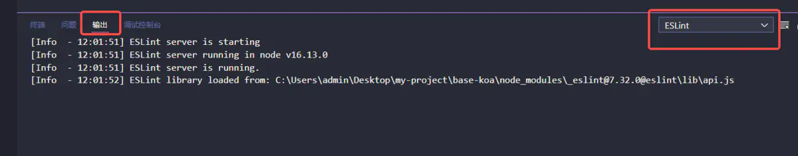
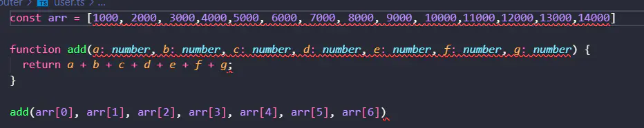
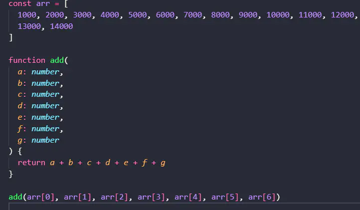

# ts项目从零配置eslint + prettier
https://www.jianshu.com/p/8f725a96789c

# 配置eslint

## 文件创建
先在项目的根目录上创建 .eslintrc.json 文件或者 .eslintrc.js 用来编写eslint配置，一个是json格式，一个需要 module.export 导出js配置，这里我选择.eslintrc.json 文件。

再创建 .eslintignore 文件， 指定忽略哪些文件的校验
创建完 .eslintrc.json 文件先放着，在 .eslintignore 文件填写上忽略的文件：

## 依赖安装
1.安装eslint:

    npm install eslint -D

2.安装esllint ts的解析器

    npm install @typescript-eslint/parser -D

这个解析器是eslint解析语法的基础，也就是eslint配置文件parser属性填写的字段，除了这个ts解析器，eslint常见的解析器还有：

    espree  //  eslint默认自带的解析器，识别不了比较新的js语法
    @babel/eslint-parser // 需要安装，能够解析比较新的js语法

3.安装js代码规范

引入业内大家普通使用的、遵循的编码规范，添加到eslint配置文件中的extends属性，该属性表示集成外部安装的一些规范，不用自己一条条手写rules配置，比如不用分号，引号用单引号，不能存在空函数，必须全等等规则。
这里选择安装standard的js规范，这个也是vue脚手架初始化时，我们选择eslint规则选择standard的时候所安装的规范。

    npm install eslint-config-standard -D

使用这个规范还需要再安装三个补丁包：

    npm install eslint-plugin-import eslint-plugin-node eslint-plugin-promise -D

4.安装ts语法规范
上面所安装的都是基础的js语法规范，一些ts独有的语法，比如interface、type等语法无法进行校验，所以需要再安装ts语法的检测规范，这里安装eslint官方的ts规则

    npm install @typescript-eslint/eslint-plugin -D

5.包版本
因为eslint以及相关的包的版本一直在更新，很容易出现不兼容部分包报错的情况，这里我贴一下我的包的版本，如果你安装完后eslint报错不生效，可以指定成我提供的版本号，重新安装：

    "@typescript-eslint/eslint-plugin": "^5.26.0",

    "@typescript-eslint/parser": "^5.26.0",

    "eslint": "^7.12.1",

    "eslint-config-standard": "^16.0.3",

    "eslint-plugin-import": "^2.26.0",

    "eslint-plugin-node": "^11.1.0",

    "eslint-plugin-promise": "^4.2.1"

## 编写配置文件
上面已经将eslint检测ts文件的插件都安装完毕，下面编写.eslintrc.json 文件：
.eslintrc.json：

    {
        "parser": "@typescript-eslint/parser", // 解析器
        
        "env": {
            "node": true,
            "es6": true
        },
        
        "parserOptions": {
            "ecmaVersion": 2020, // 指定js版本
            "sourceType": "module" // 默认为script，使用es6 module设置为module
        },
        
        "extends": [ // 集成的代码规范
            "eslint-config-standard",
            "plugin:@typescript-eslint/recommended"
        ],
        
        "plugins": [], // 插件
        
        "rules": {
            // 单独配置规则，会覆盖extends的规则
        }
    }

这就是基础的ts项目的eslint文件配置，关于 env 可以参考官方：https://eslint.org/docs/user-guide/configuring/language-options#specifying-environments，我这里的demo为node项目，不在浏览器运行。

## vscode安装插件实现保存自动修复

vscode安装eslint插件:

然后在settings.json中添加配置：

    "editor.codeActionsOnSave": {
        "source.fixAll.eslint": true // 每次保存的时候将代码按eslint格式进行修复
    }

js、ts文件eslint已经自动检测，如果你的文件没有检测生效，可以添加：

    "eslint.validate": [
        {
            "language": "typescript",
            "autoFix": true
        }
    ]

    
## 检查是否检测生效
上面的准备工作完成后，打开vscode的输出面板，选择到eslint拓展：

如上图eslint已经成功运行，并在检测

可以看到规则已生效，引入必须在文件的最前面，变量无修改优先使用const，操作符两边有空格等，目前还存在警告，表示引入了未使用，如果不想出现警告，可以到 .eslintrc.json 文件的 rules 属性中添加规则

# 配置prettier

eslint侧重于代码质量，规范一些语法的东西，比如变量名不能用下划线、ts不能用any、模块引入必须使用等。prettier则只管代码风格，比如一行不能超过多少个字符、行尾逗号、双引号单引号统一等。

## 安装以及配置文件
安装prettier插件：

    npm install prettier -D

项目根目录创建编写prettier文件，可支持js、json、yaml等，这里我创建.prettierrc.js文件

    {
        "endOfLine": "auto",
        //（默认值）单行代码超出 80 个字符自动换行
        "printWidth": 80,
        //（默认值）一个 tab 键缩进相当于 2 个空格
        "tabWidth": 2,
        // 行缩进不使用 tab 键代替空格
        "useTabs": true,
        //（默认值）禁止语句的末尾加上分号
        "semi": true,
        // 使用单引号
        "singleQuote": true,
        //（默认值）仅仅当必须的时候才会加上双引号
        "quoteProps": "as-needed",
        // 在 JSX 中使用单引号
        "jsxSingleQuote": true,
        // 不用在多行的逗号分隔的句法结构的最后一行的末尾加上逗号
        "trailingComma": "none",
        //（默认值）在括号和对象的文字之间加上一个空格
        "bracketSpacing": true,
        // 当箭头函数中只有一个参数的时候可以忽略括弧
        "arrowParens": "avoid",
        // 不允许格式化内嵌的代码块，比如 markdown  文件里的代码块
        "embeddedLanguageFormatting": "off"
    }

这里的配置是copy官方的默认配置项，对于单纯的ts项目有些并无用到。

关于endOfLine，建议设置auto就行了。

每次修改prettier配置项需要重新打开vscode才会生效

## eslint集成prettier

首先需要安装相关的包:

    npm install prettier-eslint eslint-plugin-prettier eslint-config-prettier -D

然后改造 .eslintrc.json 文件：

    {
    "parser": "@typescript-eslint/parser",
    "env": {
        "node": true,
        "es6": true
    },
    "parserOptions": {
        "ecmaVersion": 2020,
        "sourceType": "module"
    },
    "extends": [
        "eslint-config-standard",
        "plugin:@typescript-eslint/recommended", // 使用@typescript-eslint/eslint-plugin的推荐规则
        "prettier" // 放在最后
    ],
    "plugins": ["prettier"],  // 集成prettier
    "rules": {
        "prettier/prettier": "error" // 对于不符合prettier报eslint错误
    }
    }
到这里就集成完毕，同样可能会出现包版本不同造成的错误，这里我同样贴一下包的版本，大家可以选择与我相同的版本进行使用：

    "prettier": "^2.6.2",
    "prettier-eslint": "^15.0.1",
    "eslint-plugin-prettier": "^4.0.0",
    "eslint-config-prettier": "^8.5.0"

效果

保存前：

保存后：

到这里ts项目从零配置eslint + prettier就完成了。
