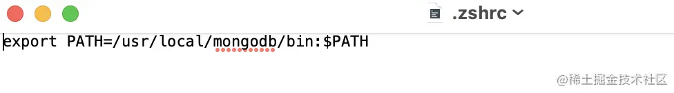

## 在终端使用 curl 命令来下载安装

1.进入 /usr/local

    cd /usr/local

2.下载

    sudo curl -O https://fastdl.mongodb.org/osx/mongodb-macos-x86_64-6.0.3.tgz

3.解压

    sudo tar -zxvf mongodb-macos-x86_64-5.0.5.tgz

4.重命名为 mongodb 目录

    sudo mv mongodb-macos-x86_64-5.0.5/ mongodb

当然，大家若是安装了HomeBrew，也可以通过 brew 命令来安装 mongodb，这里就不细说了，感兴趣的小伙伴可以自行百度了解。

## 第二步： 配置 moogodb 环境变量

1.打开终端，输入命令：cd ~ 到当前用户的家目录。

2.打开 .zshrc 文件：open ~/.zshrc，若没有此文件，就创建一个：touch .zshrc。
注意你当前使用的 mac 终端是 bash 还是 zsh。

- bash 使用 .bash_profile 文件
- zsh 使用 .zshrc 文件

3.把 MongoDB 的二进制命令文件目录（安装目录/bin）添加到 PATH 路径中。

变量如下：

    export PATH=/usr/local/mongodb/bin:$PATH

将变量添加到文件中：

4.使用命令 source ~/.zshrc 使配置生效。

## 第三步：创建日志及数据存放的目录

数据存放路径

    sudo mkdir -p /usr/local/var/mongodb

日志文件路径

    sudo mkdir -p /usr/local/var/log/mongodb

确保当前用户对以上两个目录有读写的权限

    sudo chown yangpan /usr/local/var/mongodb
    sudo chown yangpan /usr/local/var/log/mongodb

yangpan 表示你电脑上的当前用户。

## 第四步：在后台启动 mongodb

- --dbpath 表示设置数据存放目录
- --logpath 表示设置日志存放目录
- --fork 表示在后台运行

1.命令启动（每次开机都要输入下面这一长串的命令启动 mongodb，一点也不方便）

    mongod --dbpath /usr/local/var/mongodb --logpath /usr/local/var/log/mongodb/mongo.log --fork

2.配置文件启动（谁不喜欢这种简便的方式呢）

    mongod --config /usr/local/etc/mongod.conf

通过设置配置文件启动 mongodb，需要你先创建一个文件 mongod.conf，然后在文件中写入配置。具体步骤如下：

1.打开终端，切换到 /usr/local/etc 在文件夹下

    cd /usr/local/etc

2.创建 mongod.conf 文件

    touch mongod.conf

3.编辑配置文件 mongod.conf

    vim /usr/local/etc/mongod.conf

写入如下配置：

配置完成，以后再也不用输入一大串命令了，然后再 mongod --config /usr/local/etc/mongod.conf 就好了

## 补充
我们在操作 MongoDB 数据库时，若需要对数据进行备份(mongodump)或恢复(mongorestore)，则需要去官网下载 MongoDB 数据库工具。安装过程也很简单，就是将下载好的工具包解压缩，然后将里面的文件复制到你所安装的 mongodb 的 bin 目录下即可。
