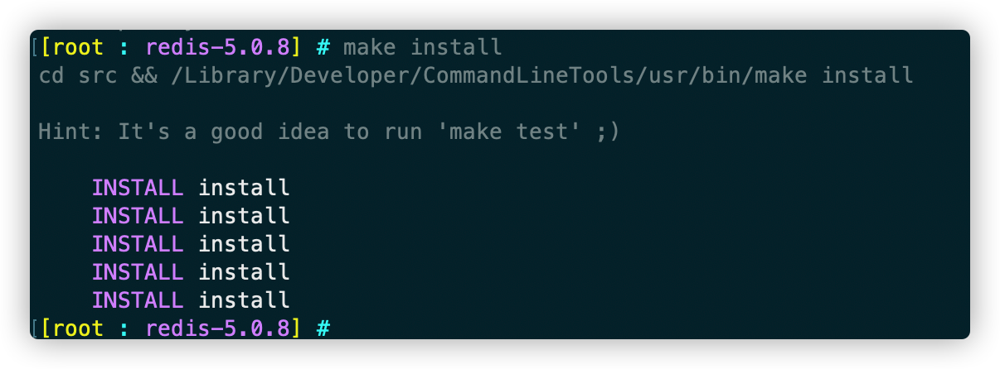

# Redis安装及配置

## 安装
1.下载Redis: [官网](https://redis.io/)

2.把下载的压缩包解压并放置到 /usr/local/ 目录下

    sudo tar -zxvf redis-stable.tar.gz -C /usr/local/

3./usr/local下，将redis-stable重命名为 redis

4.编译和安装

    cd /usr/local/redis

编译测试

    make test

> 此处可能会报错：[exception]: Executing test client: couldn't execute "src/redis-benchmark":
make[1]: *** [test] Error 1 make: *** [test] Error 2  

> 解决：执行如下命令  
> make distclean、make、make test

编译安装

    make install

## Redis配置
1.新建日志文件： log-redis.log

    cd /usr/local/redis
    touch log-redis.log

2.修改redis.conf
    cd /usr/local/redis
    vim redis.conf

修改的内容如下：

    #修改为守护模式
    daemonize yes
    #设置进程锁文件
    pidfile /usr/local/redis/redis.pid
    #端口
    port 6379
    #客户端超时时间
    timeout 300
    #日志级别
    loglevel debug
    #日志文件位置
    logfile /usr/local/redis/log-redis.log
    #设置数据库的数量，默认数据库为0，可以使用SELECT <dbid>命令在连接上指定数据库id
    databases 16
    ##指定在多长时间内，有多少次更新操作，就将数据同步到数据文件，可以多个条件配合
    #save <seconds> <changes>
    #Redis默认配置文件中提供了三个条件：
    save 900 1
    save 300 10
    save 60 10000
    #指定存储至本地数据库时是否压缩数据，默认为yes，Redis采用LZF压缩，如果为了节省CPU时间，
    #可以关闭该#选项，但会导致数据库文件变的巨大
    rdbcompression yes
    #指定本地数据库文件名
    dbfilename dump.rdb
    #指定本地数据库路径
    dir /usr/local/redis/
    #指定是否在每次更新操作后进行日志记录，Redis在默认情况下是异步的把数据写入磁盘，如果不开启，可能
    #会在断电时导致一段时间内的数据丢失。因为 redis本身同步数据文件是按上面save条件来同步的，所以有
    #的数据会在一段时间内只存在于内存中
    appendonly no
    #指定更新日志条件，共有3个可选值：
    #no：表示等操作系统进行数据缓存同步到磁盘（快）
    #always：表示每次更新操作后手动调用fsync()将数据写到磁盘（慢，安全）
    #everysec：表示每秒同步一次（折衷，默认值）
    appendfsync everysec

## Redis 服务端启动与关闭、客户端启动与关闭
1.启动服务，并制定配置文件，后台启动

    cd /usr/local/redis
    redis-server ./redis.conf

2.查看日志文件

    tail -f log-redis.log

3.打开redis客户端，测试一下redis，命令行输入

    redis-cli

4.查看一下redis进程

    ps -ef | grep -i redis

5.关闭redis

    redis-cli shutdown

6.强制关闭服务端

    sudo -i
    ps -ef | grep -i redis
    kill -9 PID

