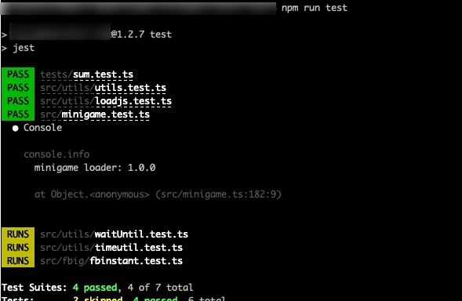

# jest搭建typescript测试环境
对于TypeScript项目，还需要做一些配置才可以使用jest。

jest并不直接支持TypeScript，但是jest允许通过代码转换器(Code Transformer)将源码解析为js代码然后交给jest进行测试。

对于TypeScript，jest官方提供了两个方案：

Babel
ts-jest
这里介绍一下ts-jest，由于不依赖Babel等，适用性更广泛一些，github地址如下：

https://jestjs.io/docs/getting-started#using-typescript-via-ts-jest

1.安装 ts-jest和@type/jest  

    npm i -D ts-jest @types/jest    

2.配置jest.config.ts  

    preset: "ts-jest",
    transform: { "^.+\\.ts?$": "ts-jest" },
    moduleFileExtensions: ["ts", "tsx", "js", "jsx", "json", "node"],

3.配置ts-config.json  

    "types": [
        "jest"
    ],

4.编写*.test.ts测试模块，设置完毕，就可以使用ts来编写测试用例，测试ts代码了。  

## 参数含义

passWithNoTests 允许在没有找到文件的情况下通过测试  
runInBand 顺序执行  
forceExit 强制退出  
colors 输出上色  

